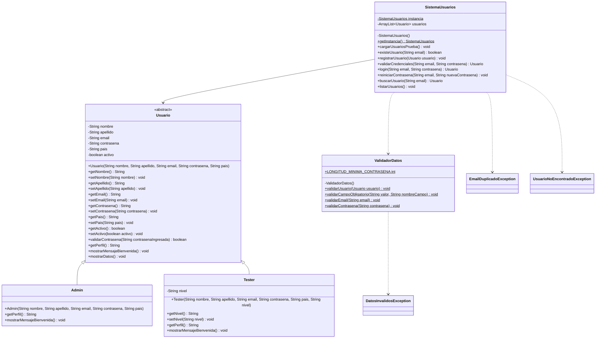

## Funcionalidades

### Autenticación de administrador

- Inicio de sesión de administrador.
    - Campos: correo electrónico y contraseña.

- Recuperación de contraseña desde el inicio de sesión.
    - Redirección a la pantalla **“Reiniciar contraseña”**.

- Creación de cuenta de administrador desde el inicio de sesión.
    - Redirección a la pantalla **“Registrarse”**.

- Cierre de sesión de administrador.
    - Redirección al home de administrador.

### Registro de administrador

- Registro de nueva cuenta de administrador.
    - Campos: nombre, apellido, correo electrónico, contraseña, repetir contraseña y país de nacimiento.

- Acceso a recuperación de contraseña desde el registro.
    - Redirección a la pantalla **“Reiniciar contraseña”**.

- Finalización de registro.
    - Redirección al home.

- Acceso a inicio de sesión desde el registro.
    - Opción **“Ya tengo cuenta”**.

### Recuperación de contraseña

- Reinicio de contraseña para cuenta de administrador.
    - Campos: correo electrónico, nueva contraseña y repetir contraseña.

- Confirmación de reinicio de contraseña.
    - Redirección al home.

- Acceso a registro desde la recuperación de contraseña.
    - Opción **“Crear cuenta”**.

- Acceso a inicio de sesión desde la recuperación de contraseña.
    - Opción **“Ya tengo cuenta”**.

### Navegación y menú

- Menú hamburguesa lateral con acceso a:
    - Iniciar sesión.
    - Registrarse.
    - Reiniciar contraseña.

- Despliegue y colapso del menú hamburguesa lateral.

- Menú acordeón en el home de administrador para mostrar opciones de autenticación cuando el usuario no está logueado.

## Funcionalidades posteriores al login

### Menú lateral

- Menú hamburguesa lateral con acceso a:
    - Crear usuario.
    - Reiniciar contraseña de usuario.
    - Ver usuarios.

- Despliegue y contracción del menú lateral.

### Crear usuario

- Alta de cuenta para testers.
    - Campos: nombre, apellido, email, país de nacimiento y contraseña por defecto.
    - Selección de perfil mediante opción única:
        - Tester junior.
        - Tester senior.
        - Tester líder.

### Reiniciar contraseña de usuario

- Reinicio de contraseña de usuario.
    - Campos: email, nueva contraseña y repetir contraseña.

### Ver usuarios

- Visualización de usuarios en una tabla con las siguientes columnas:
    - Apellido.
    - Email.
    - País.
    - Perfil.
    - Acción.

- Eliminación de usuarios no administradores desde la columna **“Acción”**.

### Perfil de administrador

- Acceso al perfil desde el menú ubicado en la parte superior derecha.

- Despliegue de un acordeón con las opciones:
    - Ir al perfil.
    - Cerrar sesión.

- Visualización y edición de datos del perfil.
    - Campos editables: nombre, apellido, email y país.
    - Campo no editable: perfil.

- Confirmación de cambios mediante botón **“Confirmar cambios”**.

## VC4 - Mejora del diseño y colecciones

En esta etapa se mejora la solución anterior aplicando colecciones, abstracción y polimorfismo.

Cambios realizados:

- Se reemplazó el arreglo de usuarios por una colección ArrayList.
- La clase Usuario ahora es abstracta.
- Admin y Tester heredan de Usuario.
- Se agregaron métodos abstractos para representar comportamientos comunes.
- Cada tipo de usuario implementa su propio mensaje de bienvenida.
- Se agregó búsqueda de usuario por email.
- Se agregó listado de todos los usuarios.
- Se amplió el menú principal.

## Versión final

Esta versión completa el sistema de gestión de usuarios desarrollado durante el curso.

### Funcionalidades disponibles

- Iniciar sesión.
- Registrar un usuario administrador.
- Dar de alta usuarios Tester después de iniciar sesión.
- Listar todos los usuarios.
- Buscar un usuario por email.
- Reiniciar la contraseña de un usuario.
- Ver el perfil del usuario que inició sesión.
- Cerrar sesión.
- Salir del sistema.

### Validaciones y manejo de errores

- Los campos obligatorios no pueden quedar vacíos.
- El email debe tener un formato válido.
- No se permiten usuarios con emails duplicados.
- La contraseña debe tener como mínimo 6 caracteres.
- Se controlan las opciones inexistentes y los valores no numéricos del menú.
- Los errores se informan en pantalla y el programa permite continuar usando el sistema.
- Se utilizan las excepciones personalizadas `DatosInvalidosException`,
  `EmailDuplicadoException` y `UsuarioNoEncontradoException`.

### Mejora de diseño

La clase `SistemaUsuarios` aplica el patrón Singleton. De esta forma existe una única
instancia del sistema y una sola colección de usuarios durante la ejecución del programa.
La clase `ValidadorDatos` concentra las validaciones para separar esa responsabilidad de
la gestión de usuarios.

## Cómo ejecutar el proyecto

Requisitos:

- IntelliJ IDEA.
- Java JDK 17 (Temurin 17 recomendado).

Pasos para ejecutar desde IntelliJ IDEA:

1. Abrir la carpeta del proyecto.
2. Esperar a que IntelliJ cargue la configuración del proyecto.
3. Verificar en **File > Project Structure > Project** que el SDK sea Temurin 17.
4. Abrir la clase `src/principal/Main.java`.
5. Hacer clic en el icono verde ubicado junto al método `main`.
6. Seleccionar **Run 'Main.main()'**.

El proyecto ya incluye la configuración de IntelliJ y reconoce la carpeta `src` como
carpeta de código fuente.

Usuarios de prueba incluidos:

- Administrador: `admin@mail.com` / `admin123`.
- Tester: `tester@mail.com` / `tester123`.

Los Testers creados desde el menú reciben la contraseña inicial `Tester123`.

## Diagrama de clases UML

